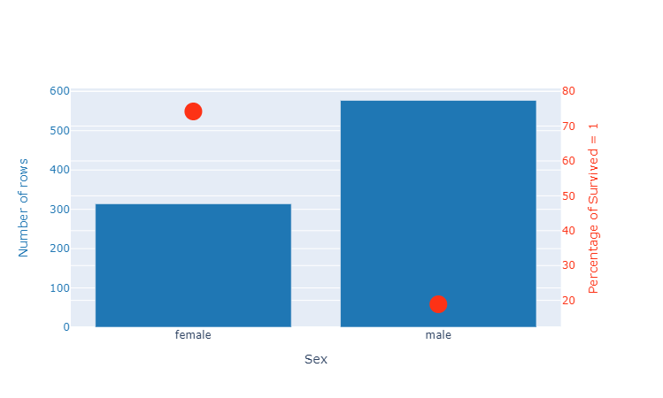
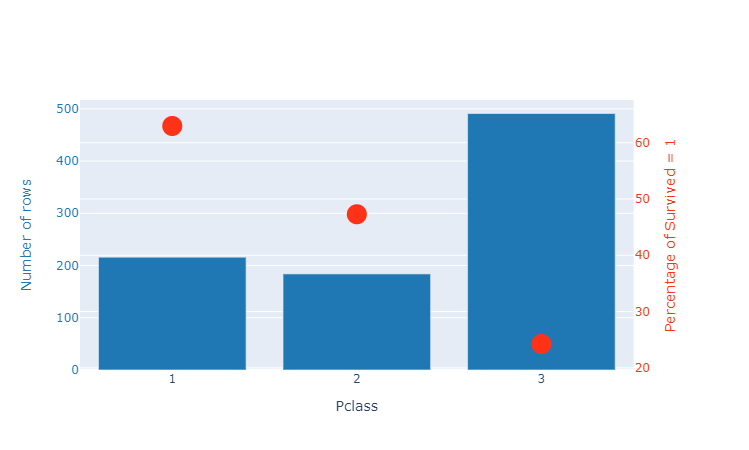

# target_description

La libreria `target_describe` es un complemento para la visualizacion de la relacion entre la variable objetivo y las variables para los problemas de machine learning, más allá de una matriz de correlación.

# Modos disponibles

Por el momento solo soporta problemas de clasificación binaria, poco a poco soportará problemas de regresión y clasificación multiple

# Ejemplo de uso

La libreria hace uso de [Plotly](https://plotly.com/), por lo que se recomienda su uso en Jupyter Notebook

```python

import pandas as pd
from target_describe import targetDescribe
df = pd.read_csv(
    "https://raw.githubusercontent.com/datasciencedojo/datasets/master/titanic.csv"
)

td = targetDescribe(df,"Survived", problem="binary_classification")
td.all_associations()
```




Sin embargo tambien puedes hacer uso de la libreria mediante un script de python exportando directamente los gráficos en html.

```python

import pandas as pd
from target_describe import targetDescribe
df = pd.read_csv(
    "https://raw.githubusercontent.com/datasciencedojo/datasets/master/titanic.csv"
)

td = targetDescribe(df,"Survived", problem="binary_classification")
td.all_associations(export=True)
```
